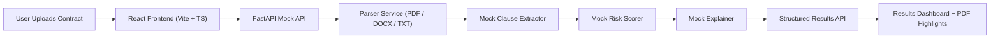

# LexAI


LexAI is a production-style AI contract analysis app that extracts clauses, scores legal risk, and explains the highest-risk provisions in plain English.

[](https://react.dev/)
[](https://www.typescriptlang.org/)
[](https://vitejs.dev/)
[](https://fastapi.tiangolo.com/)
[](https://tailwindcss.com/)

## Overview

LexAI is designed as a recruiter-facing capstone project that demonstrates full-stack engineering, AI product thinking, and clean API-first architecture. Version 1 uses a deterministic FastAPI mock backend so the frontend experience is stable, fast, and ready for demos. The backend contract is intentionally shaped so a real HuggingFace inference pipeline can replace the stub later without frontend changes.

## Architecture



## Project Structure

```text
lexai/
├── frontend/
├── backend/
├── .github/workflows/deploy.yml
└── README.md
```

## Local Setup

### Frontend

```bash
cd frontend
npm install
npm run dev
```

Set `VITE_API_BASE_URL` to your backend URL if it is not running at `http://localhost:8000`.

### Backend

```bash
cd backend
python -m venv .venv
.venv\Scripts\activate
pip install -r requirements.txt
uvicorn main:app --reload
```

The backend accepts PDF, DOCX, and TXT uploads, parses basic metadata, simulates a multi-stage AI pipeline with realistic delays, and returns deterministic contract risk results.

## Screenshots


Landing page with premium AI SaaS styling and upload CTA.


Upload workflow with animated pipeline progress.


Dashboard with risk overview, clause cards, PDF preview, and export actions.

## API Contract

### `POST /api/analyze`

Uploads a contract as multipart form-data with the `file` field and returns a session identifier plus initial progress metadata.

### `GET /api/results/{session_id}`

Returns a structured analysis payload with clause-level risk details, explanations, and a risk distribution summary.

## Deployment

Frontend deployment is handled through GitHub Actions and GitHub Pages.

Live demo placeholder: [https://your-username.github.io/lexai/](https://your-username.github.io/lexai/)

Backend deployment is intentionally separate and should point to a HuggingFace Space or other API host through `VITE_API_BASE_URL`.

## Dataset Credits

- [CUAD](https://www.atticusprojectai.org/cuad)
- [ContractNLI](https://stanfordnlp.github.io/contract-nli/)

## Future Work

- Replace the mock pipeline with task-specific LoRA or adapter-based models on HuggingFace.
- Add adapter hot-swap support for clause extraction, risk scoring, and explanation stages.
- Introduce authentication, saved sessions, and team review workflows.
- Export branded PDF reports with legal review summaries and audit logs.

## License

MIT
